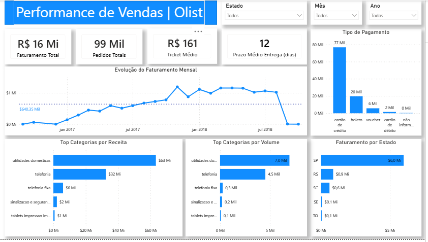

# Dashboard de Performance de Vendas | Olist

Projeto de análise de dados utilizando SQL, Excel e Power BI com foco em indicadores de performance comercial e análise temporal.

## Objetivo

Desenvolver um dashboard executivo para monitoramento de vendas e performance comercial utilizando dados do marketplace Olist.

## Tecnologias utilizadas

- SQL
- Power BI
- Excel
- DAX

## Indicadores analisados

- Faturamento Total
- Pedidos Totais
- Ticket Médio
- Prazo Médio de Entrega
- Faturamento por Categoria
- Volume por Categoria
- Faturamento por Estado
- Métodos de Pagamento

## Processo do projeto

1. Extração de dados via SQL  
2. Consolidação dos resultados em Excel  
3. Modelagem de dados no Power BI  
4. Criação de tabela calendário  
5. Construção de medidas em DAX  
6. Desenvolvimento do dashboard final  

## Arquivos do projeto

- `olist_sales_dashboard.pbix` → dashboard Power BI
- `sales_analysis_queries.sql` → consultas SQL
- arquivos `.xlsx` → outputs das análises

## Dashboard

## Principais insights

- Identificação das categorias com maior faturamento
- Distribuição geográfica das vendas
- Ticket médio consolidado
- Prazo médio de entrega
- Métodos de pagamento mais utilizados

## Autor

Matheus Silva Lima
